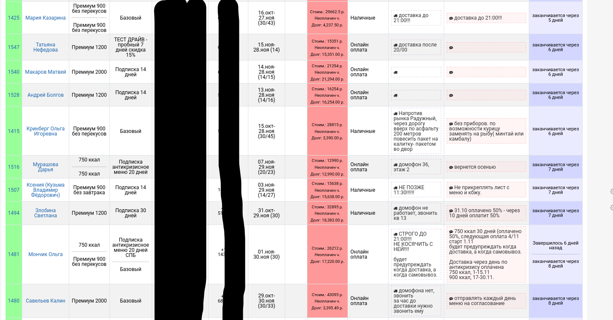
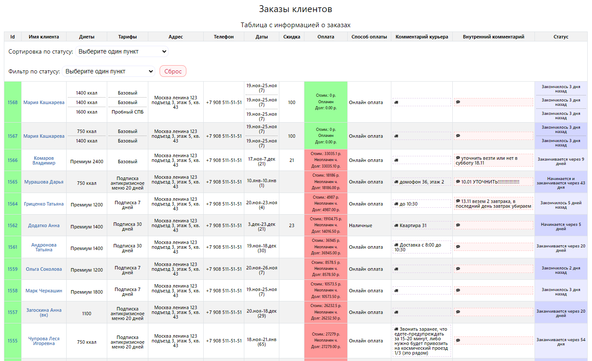

# Решение тестового задания на вакансию Frontend разработчика

##  [Ссылка на задание](https://gitlab.com/sibkod/test)

## Текст задания:

<b>Задача:</b>
Ваша задача - создать простую таблицу с использованием Vue 3, которая будет отображать данные из JSON и обеспечивать сортировку по всем столбцам.

<b>Требования:</b>

Используйте Vue 3 для создания компонента таблицы.
Реализуйте таблицу, отображающую данные из JSON.
Обеспечьте сортировку данных по столбцу статус.
Добавьте функционал смены направления сортировки при повторном нажатии на заголовок столбца (по возрастанию/убыванию).
Отобразите все столбцы из JSON данных в таблице.

<b>Условия:</b>
У одного клиента может быть одна и более диет (Каждая диета должна быть отделена от другой горизонтальным разделителем.)
в заказе и они могут иметь разное время окончания.
Нужно учесть это при сортировке.

<b>Сортировка по статусу:</b>
- Начинается через Х дней. (где чем больше х тем выше в списке)
- заканчивается сегодня
- заканчивается завтра
- заканчивается через Х дней (где чем больше х тем ниже в списке)
- закончилось Х дней назад (где чем больше х тем ниже в списке)

<b>Доп задание:</b>
Реализовать фильтр по столбцам.
Например, отобразить заказы со статусом Начинается через Х дней

* Решение задачи предоставить любым удобным способом. Ссылка на репозиторий, архив, общий документ и т. д.

Пример таблицы

## Решение задания:

### 1. Создано приложение ***Vue***.
### 2. Создан ***HTML*** макет.
### 3. Созданы ***CSS*** стили с использованием препроцессора ***SCSS***.
### 4. Написан код на языке ***Typescript***.

## Запуск кода:

### 1. **npm install** - установка зависимостей.
### 2. **npm run dev** - запуск кода в режиме разработки.

## Пример готовой таблицы:

